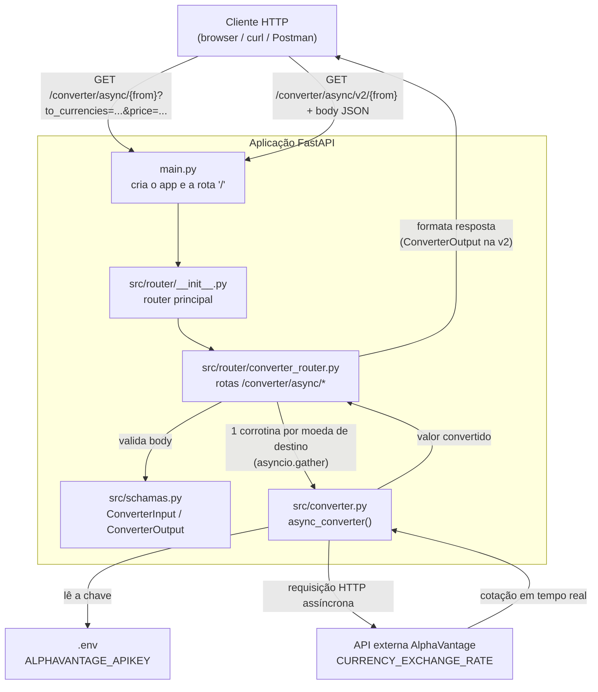
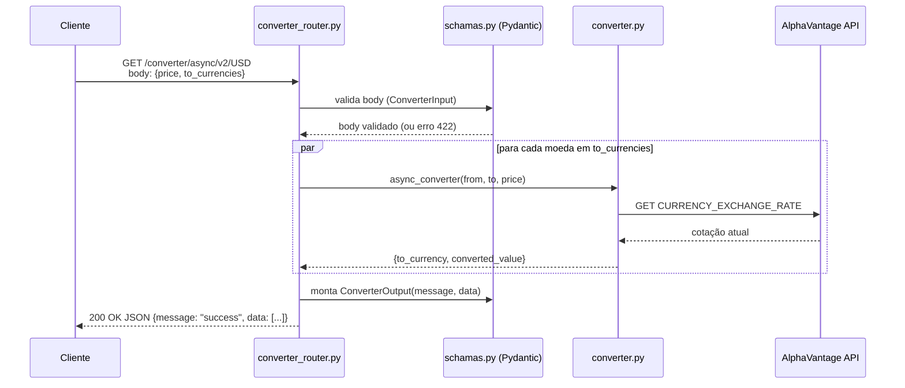

# Omni Money (fxmoney)

API de conversão de moedas em tempo real, construída com **FastAPI**. Consulta a cotação atual de um par de moedas na API pública [AlphaVantage](https://www.alphavantage.co/) e devolve o valor convertido para uma ou várias moedas de destino, em paralelo.

## 1. O que é este projeto

Um pequeno serviço web (API REST) que recebe um valor monetário em uma moeda de origem e retorna esse valor convertido para uma ou mais moedas de destino, usando cotações em tempo real.

O projeto também documenta, na própria estrutura de pastas, a sua evolução:

- `studies/` — versões de estudo/protótipo, com a implementação **síncrona** inicial e os primeiros testes de rota.
- `src/` — versão "de produção" do projeto, **assíncrona**, já com validação de dados via Pydantic e execução de múltiplas conversões em paralelo.

Essa evolução fica visível no histórico de commits: primeiro um protótipo síncrono, depois a versão assíncrona, depois paralelização das conversões e, por fim, uma rota v2 recebendo parâmetros via *body* com schemas de entrada/saída.

## 2. Para que serve e benefícios para o desenvolvedor

O projeto serve como uma base de estudo prática (e reutilizável) de como construir uma API com FastAPI do zero até um nível intermediário. Benefícios diretos para quem for estudar o código ou usá-lo como referência:

- **Comparação sync vs. async na prática**: `studies/converter.py` (com `requests`, bloqueante) ao lado de `src/converter.py` (com `aiohttp`, não bloqueante) — dá pra ver o mesmo problema resolvido das duas formas.
- **Paralelismo real com `asyncio.gather`**: converter para várias moedas de destino ao mesmo tempo, em vez de fazer uma requisição HTTP por vez.
- **As três formas de receber parâmetros no FastAPI**: path parameter, query parameter e body parameter, todas exemplificadas em rotas reais do projeto.
- **Validação de dados com Pydantic**: `ConverterInput`/`ConverterOutput` mostram validação customizada (`@validator`), `Field` com restrições (`gt=0`) e `response_model` para formatar a saída da API.
- **Organização de rotas em módulos (`APIRouter`)**: como dividir a aplicação em routers menores e agregá-los em um router principal, prática comum em APIs maiores.
- **Configuração segura de segredos**: uso de `.env` + `python-dotenv` para a chave da API, mantendo o segredo fora do controle de versão (`.gitignore`).
- **Gerenciamento de dependências com Poetry**: `pyproject.toml` e `poetry.lock` como referência de projeto Python moderno.

Ou seja, é um repositório pequeno o bastante para ler em poucos minutos, mas que toca em vários conceitos que aparecem em APIs reais em produção.

## 3. Principais técnicas e tecnologias utilizadas

| Técnica / Conceito | Onde aparece | Tecnologia |
|---|---|---|
| Criação da aplicação web e rotas | `main.py`, `src/router/*` | **FastAPI** |
| Servidor ASGI para rodar a aplicação | execução do projeto | **Uvicorn** |
| Requisição HTTP assíncrona (não bloqueante) | `src/converter.py` | **aiohttp** |
| Requisição HTTP síncrona (bloqueante, versão de estudo) | `studies/converter.py` | **requests** |
| Execução de múltiplas tarefas assíncronas em paralelo | `src/router/converter_router.py` | **asyncio.gather** |
| Validação de dados de entrada/saída e regras customizadas | `src/schamas.py` | **Pydantic** (`BaseModel`, `Field`, `@validator`) |
| Validação de parâmetros de rota via regex | `src/router/converter_router.py` | FastAPI `Path` / `Query` com `pattern` |
| Leitura de segredos/configuração via variáveis de ambiente | `src/converter.py` | **python-dotenv** |
| Fonte de dados de câmbio em tempo real | `src/converter.py` | **API AlphaVantage** (`CURRENCY_EXCHANGE_RATE`) |
| Gerenciamento de dependências e ambiente virtual | raiz do projeto | **Poetry** |

## Dicionário de dados do projeto

Estrutura de pastas e a responsabilidade de cada arquivo:

```
Omni_money/
├── main.py                          # Ponto de entrada da aplicação FastAPI
├── pyproject.toml                   # Metadados do projeto e dependências (Poetry)
├── poetry.lock                      # Versões travadas das dependências
├── poetry.toml                      # Configuração local do Poetry (cria venv no próprio projeto)
├── .env                              # Segredos locais (chave da AlphaVantage) — NÃO versionado
├── .gitignore                        # Arquivos/pastas ignorados pelo Git
├── src/                               # Código-fonte "oficial" da aplicação
│   ├── __init__.py                   # Marca a pasta como pacote Python (vazio)
│   ├── converter.py                  # Lógica de conversão de moedas (chamada assíncrona à AlphaVantage)
│   ├── schamas.py                    # Schemas Pydantic (validação de entrada/saída da rota v2)
│   └── router/                        # Rotas HTTP da aplicação
│       ├── __init__.py               # Agrega os routers do projeto em um router principal
│       └── converter_router.py       # Define as rotas /converter/async/{...} e /converter/async/v2/{...}
└── studies/                            # Código de estudo/protótipo (não usado pela aplicação em execução)
    ├── converter.py                  # Primeira versão da lógica de conversão (síncrona e assíncrona lado a lado)
    └── converter_router.py           # Primeira versão das rotas (parâmetros crus, sem Pydantic)
```

### Detalhamento por arquivo

| Arquivo | Responsabilidade |
|---|---|
| `main.py` | Cria a instância `FastAPI()`, registra o router principal e define a rota raiz `GET /`. |
| `src/converter.py` | Função `async_converter(from_currency, to_currency, price)`: monta a URL da AlphaVantage, faz a requisição assíncrona, trata erros (`HTTPException`) e retorna o valor convertido junto com a moeda de destino. |
| `src/schamas.py` | `ConverterInput` (valida `price` positivo e lista `to_currencies` no padrão `AAA`) e `ConverterOutput` (formata a resposta como `{message, data}`) da rota v2. |
| `src/router/converter_router.py` | Define duas rotas: `GET /converter/async/{from_currency}` (destinos via *query param*) e `GET /converter/async/v2/{from_currency}` (destinos via *body*, validado por `ConverterInput`, resposta tipada por `ConverterOutput`). Ambas convertem para várias moedas em paralelo com `asyncio.gather`. |
| `src/router/__init__.py` | Importa o `converter_router` e o inclui em um `APIRouter()` principal, que é o que `main.py` registra na aplicação. |
| `studies/converter.py` | Versão de estudo com `sync_converter` (usando `requests`) e `async_converter` (usando `aiohttp`), lado a lado, para comparação. |
| `studies/converter_router.py` | Versão de estudo das rotas, sem Pydantic: `GET /converter/{from_currency}` (síncrona) e `GET /converter/async/{from_currency}` (assíncrona), ambas com parâmetros crus (`str`/`float`, sem `Path`/`Query`). |
| `.env` | Guarda `ALPHAVANTAGE_APIKEY`, a chave de acesso à API externa. Ignorado pelo Git. |
| `pyproject.toml` | Nome do projeto (`fxmoney`), versão, autor e dependências (`fastapi`, `pydantic`, `uvicorn`, `requests`, `aiohttp`, `python-dotenv`). |

## Diagrama de arquitetura

Como os módulos se relacionam dentro do projeto:



## Diagrama de sequência (rota v2 com body)

Como uma requisição é processada, do cliente até a resposta:



## Como rodar localmente

```bash
# instalar dependências (Poetry cria o venv dentro do projeto por causa do poetry.toml)
poetry install

# criar o arquivo .env na raiz com a chave da AlphaVantage
echo "ALPHAVANTAGE_APIKEY=sua_chave_aqui" > .env

# subir o servidor de desenvolvimento
poetry run uvicorn main:app --reload
```

Endpoints disponíveis:

- `GET /` — mensagem de boas-vindas.
- `GET /converter/async/{from_currency}?to_currencies=EUR,JPY&price=100` — conversão via query params.
- `GET /converter/async/v2/{from_currency}` com body `{"price": 100, "to_currencies": ["EUR", "JPY"]}` — conversão via body, com resposta tipada.
